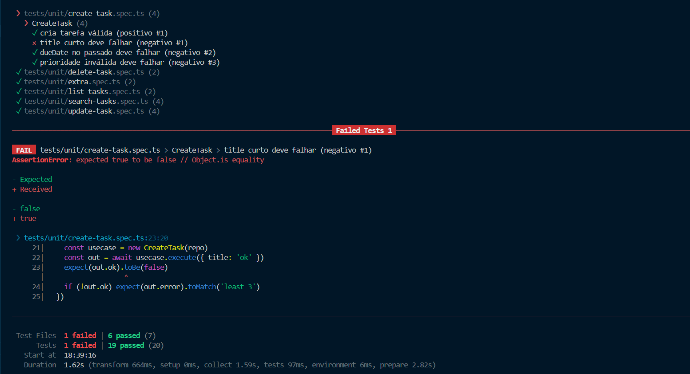
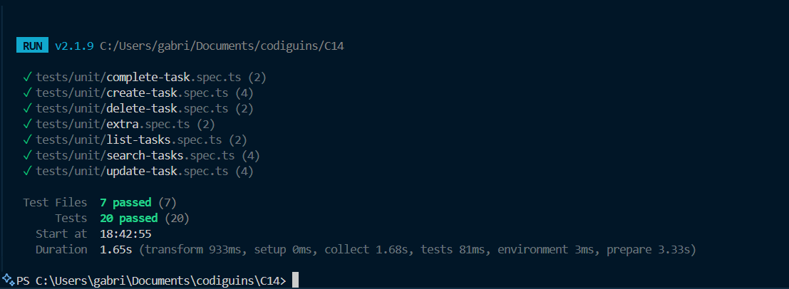
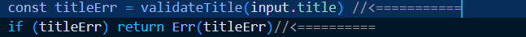

Atividade de regressão para validar cobertura de tests
Imagem dos testes após PR solicitada

foi removido uma condicional do código, após a correção o testes voltaram a passar.

trecho que tinha sido removido: